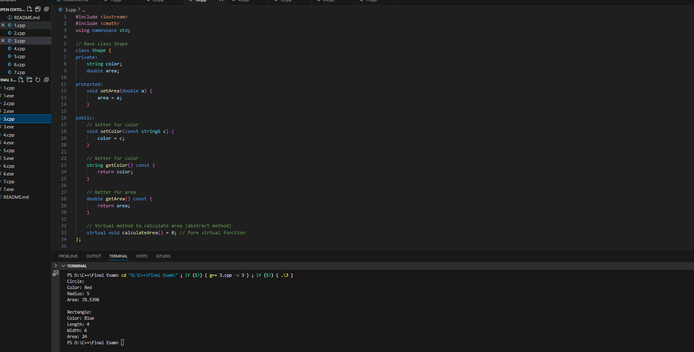
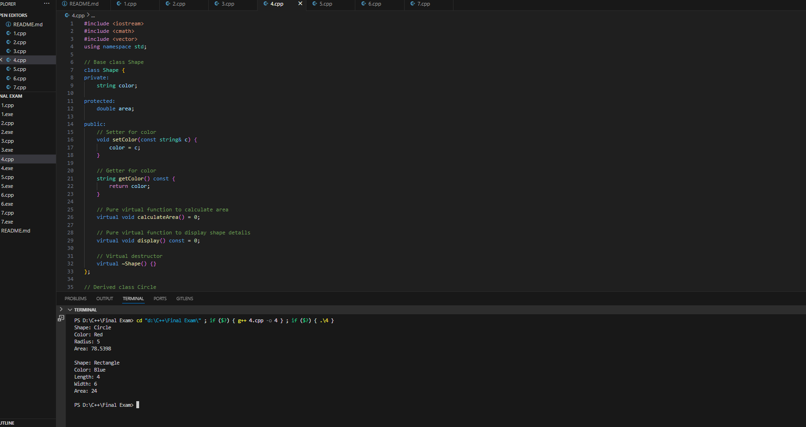
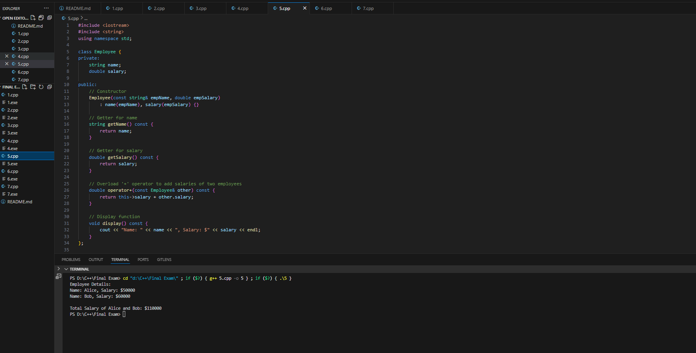
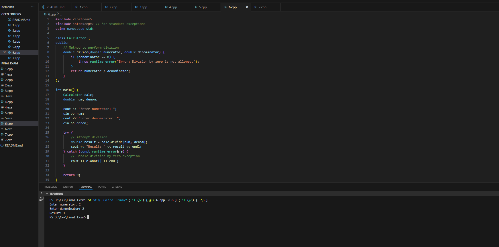
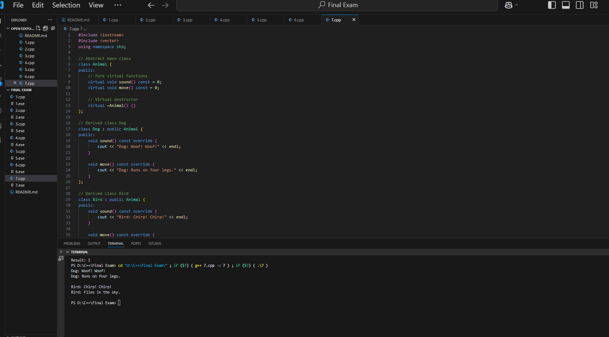

<h1 align="center"> C++ Practical Exam</h1>
<h1> 1 Practical </h1>

<h1> 2 Practical </h1>

<h1> 3 Practical </h1>

<h1> 4 Practical </h1>

<h1> 5 Practical </h1>

<h1> 6 Practical </h1>

<h1> 7 Practical </h1>

